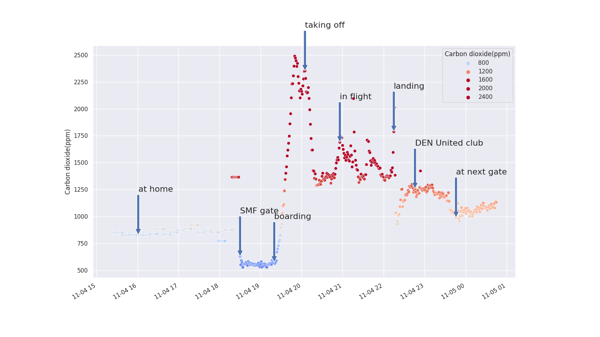

# Graph data file(s) from an aranet4 sensor

The `aranet4-graph` (python) program takes a YAML input file for
configuration that allows loading and graphing of a CSV file that has
been exported from the aranet4 phone app.  The YAML configuration
supports specifying the `file` to load, `begin` and `end` timestamps
to limit the graph to and a set of `markers` for having arrows that
point at the graph.  Each marker can be a simple string, or may be a
dictionary and a `label` and a `y_offset` that sets the vertical
offset (default 400) of the label and arrow length and a `x_offset`
(in seconds) for the horizontal offset (default 0).

Example:

``` yaml
input:  2022-11-05-smf-to-lhr.csv
output: 2022-11-05-smf-to-lhr.png
begin: "2022-11-04 08:23 PDT"
markers:
       "2022-11-04 09:00 PDT": "at home"
       "2022-11-04 11:30 PDT": "SMF gate"
       "2022-11-04 12:20 PDT":
         label: "boarding"
         y_offset: 600
       "2022-11-04 13:05 PDT":
         label: "taking off"
         y_offset: -200
         h_offset: -1800
       "2022-11-04 13:55 PDT": "in flight"
       "2022-11-04 16:14 MDT": "landing"
       "2022-11-04 16:45 MDT": "DEN United club"
       "2022-11-04 17:45 MDT": "at next gate"
end:   "2022-11-04 18:45 MDT"
```

Note that when reading the data in, the timestamps are expected to be
in UTC and your phone's aranet4 export feature will put them in your
local timezone date/time instead.  Thus you can add an adjustment
based on **when/where you extracted the data from your phone**.  For
example, if I download the data in California during PDT, I'm negative
8 hours off from UTC for this source CSV data file.  So in my *yaml*
file I can account for this:

``` yaml
hours_offset: -8
```

# Installation

    pipx install aranet4-graph

or
    pip install aranet4-graph

# Example output



# Source code

https://github.com/hardaker/aranet4-graph

# Sources of (randomish) information

- [United airlines filtering:](https://www.youtube.com/4ZvIoVfqbw0)
